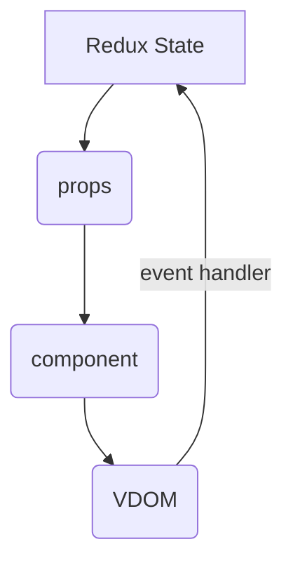

**Redux**
* Redux does maintains state which will be then converted into props.These Props are provided to the component which retruns the view and gets into the browser then browser generates events these events makes changes in the redux state.


* Event handlers makes changes in the redux state where again converted into props fed to the component where can lead to rerendering the component.
* The state change is so functional in redux model.It properly represents state as values.The whole component tree is pure.No need to maintain any state any where.React being a component as function of state or function of data is very well represented in this model.

>Redux maintains only state it cannot maintain side effects like fetching data handling local storage those can not be part of redux state where those should be handled seperatly.

**Disadvantages of Redux:**

* There are some libraries where we can handled effects seperatly along with redux i.e redux saga,redux thunk or redux-observable etc.

* Though Redux keeping the component tree pure and very consistent but maintaining state is complex.Fine tuning the performance optimization the way we want to is difficult.

* All of the components needs to maintain all of their state in redux where it should be fine tuned. All the state values needs to be properly archestrated. The state is need to each component is actually defined and manipulated by somewhere else meaning maintaing state at global level where Locality is need won't make much sense. 

* Understand the secenerio where global state is required which makes change things in one place might effect the things in another place just as redux do otherwise it is better to use local state but the moment we use local state the component purity will be gone.

> In Redux every time an action dispatched then state changes.state transitions are atomic.We can get from one state to another through simple dispatch functions without bothering about component which makes it more predictable and makes easy way to debug.
 
```redux -> action ->dispatched ->initial_state -> action ->action->state```

**React treating component as Object:**
* Imagine There exists a component tree where one being parents and Each parents contains children components.Each child components might have more children.
* The tree constructed through VDOM is stable meaning most of the elements remains unchanged.
* React wont renders every single thing on the page when ever a change in state occurs it only renders what is supposed to render meaning component whose state is changed.
* Whenever first rendering(initial rendering) occurs react makes an object pointing to its component tree.
* whenever next renders appears it does reconciliation and renders that perticular component based on position it is in the component tree.
* React compares it based on position beacause each component may contain state.
* Consider every component consists of state. Each component state is associated with the respective component based on its position in the tree.React is doing this by treating a component as object consists of state and behaviour and position as identity.With array of elements react identifies each component associates its position by giving it a key so that react identifies which state attached to which component.
* Every componet is an object that is why it contains state what useState does is after first render react puts a state slot based on the position.Now whenever the component is re-rendered the associated state slot will be identified based on the position and will get updated.State is maintained by react external to our component tree but it is attached to it when ever it is needed based on its position. 
