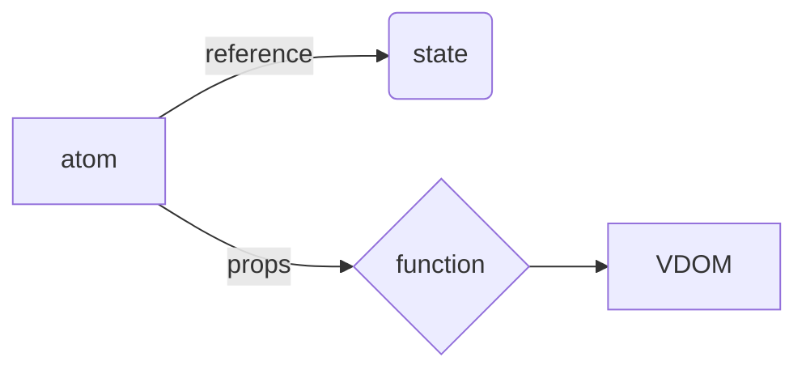

**Origin of Reactive programming:**
----

* React follows Reactive programming approach.
* derived value is a varibales which varies with reactive variable with time. In this way derived values always depends upon either reactive variable or another derived value.
* whatever sets the derived value is a pure function where it can make code more predictable and reliable.
* whatever sets the reactive variable should come from outside world which makes it less predictable.where as derived value is because of reacive variable not from outside world.
* As this way we dont have to stick to imperative programming just because we have reactive variables(state and effects).Reactive programming allows us to enable functional programming as much as possible along with state and effects. 

**React work flow**
---
> * consider there is an atom nothing but a reference to a state variable.It will update with  new state reference when ever an event handler called.After that a new set of props would be sent to the function eventually leads to a vdom renders the UI with updated state.Always think the whole page / application is state and representation of that page is UI.


* In terms of reactive programming we can say atom is reactive variable and state is that reactive variable value when ever event handlers triggers a change in state we will new set of props from that state which are will be given to pure function leads to updation of VDOM(another derived value).
* props can also be considered as derived value if state and props are two different values.


> We have our own state manager which will hold onto an atom which is mutable pointer.
> Everytime an event happens an Action object is constructed which will be provided to state manager.
> State manger will take that action object and current state and provide that to pure function nothing but a reducer which generates a new state. Atom will now points to this new state since its changed react rerenders a updated vdom.
> The main advantage of this model is there is only single mutable pointer.

```js
const CounterPage = () => {
const [state,dispatch] = useReducer(reducer,{count:initialState})
return (
    <PureComponent props={f(state)}>
)}
```
>* useReducer gives state and dispatch function. where state is being current value from which we can create props that will fed to some perticular pure component.
>* dispatch function takes an action object gives it to state manager.
>* State manager takes that action object and gives to reducer which gives new state. That new state is managed by useReducer.
>* Everytime we use a useReducer PureComponent will become a derived value.every time state changes useReducer idetifies that change and react rerenders PureComponent so does it is a derived value.

``` JS
type CounterProps = {
    count:number
    increment():void
}

const Counter = ({count,increment}:CounterProps) => {
return (
    <span>
    <button onclick={increment}>+</button>
    <div>{count}</div>
    <button>-</button>
    </span>
)
}

const initialState = {counts:[10,20,30]}

type State = typeof initialState
type Action = {type:"increment"}

const counterReducer = (state:State,action:Action) => {
    if(action.type === "increment") {
        const[first,...rest] = state.counts
        return {counts:[first+1,...rest]}
    }
    return state
}

const CounterPage = () => {
    const [state,dispatch] = useReducer(counterReducer,{count:initialState})

    const increment = () => {
        dispatch({type:"increment"})
    }

    return (
        <Counter count={state.counts[0]} increment={increment}/>
    )
}

const root = createRoot(document.getElementById('root'))
root.render(<CounterPage />)
```

>* whenever the event handler called the dispatch which is returned by useReducer is responsible for calling that counterReducer which takes current state and updates it calls the dispatch agian.
>* In the above Counter example except CounterPage everything else is pure. Since CounterPage is consists sideeffect like increment and maintains state (reactive variable) here is called **Stateful Component** 
>* Counter component itself is a pure component since it does not have any side effect or changing outside world.
>* counterReducer is also pure function in a way that it take current state and transforming it into new state.
>* initial state is also immutable. A new state variable can come but all of them are immutable any value that can be used in react component hierarchy are immutable.
>* As such way we can keep most of the code as much pure as possible though some of the parts are impure.